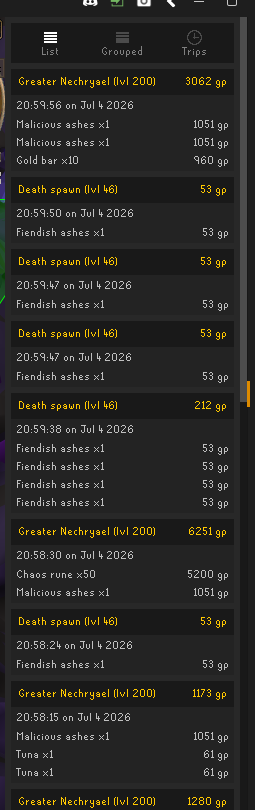
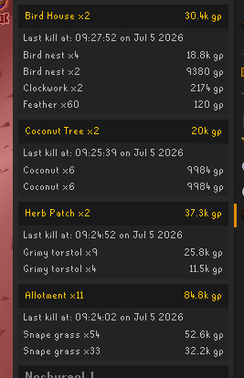

# Trip Tracker — Feature Backlog

## To Do

### 1. Item sprite display mode
Configurable option to display items as sprite icons overlaid with quantity (like RuneLite's native Loot Tracker) rather than the current text list. Uses `ItemManager.getImage(itemId, quantity, stackable)` to render item sprites in a grid. Should be a toggle in config so users can switch between text and sprite mode.

### 2. Schema version for persisted data
Add a `"version": N` field to the root of `drops.json` and `trips.json`. Load logic should check version and run migration functions when the format changes. See `.kiro/steering/data-persistence.md` for the rules.

### 3. Trip persistence across client close
Do not automatically deactivate trips when the client shuts down. A trip may span a relog (e.g., DKs, slayer tasks). Instead:
- Keep trips active across restarts
- Add a configurable max inactive time (e.g., 30 minutes). If the client restarts and more than X minutes have passed since the last drop in the trip, auto-stop it.
- This prevents zombie trips that stay "active" for days after a player forgets about them.

### 4. NPC filter in list and grouped view
Search/filter box at the top of list view and grouped view. Typing filters drops to only show those matching the NPC name. Useful when the list is long and you want to find a specific monster.

### 5. Trip filter in trip view
Similar to #4 but for trips. Search by trip name to find specific trips when you have many.

### 6. Configurable item highlighting (text mode)
When in text-list mode, allow users to configure a GP threshold (e.g., 50k+). Items exceeding that value are highlighted in a different color (e.g., green or gold) to make valuable drops stand out at a glance.

### 7. Damage/prayer stats per trip
Track damage dealt, damage received, and prayer points used/restored during a trip. Would require subscribing to:
- `HitsplatApplied` event for damage dealt/received
- `StatChanged` event for prayer point changes
Display as additional trip stats alongside kills, value, GP/hour.

### 8. Detailed trip stats page
A drill-down view for each trip showing:
- Full breakdown by NPC (kills, value, GP/kill per NPC)
- Most/least valuable drops
- Drops per hour
- Item frequency table
- Timeline of kills (when during the trip each kill happened)
Accessed via right-click → "Details" on a trip header.

### 9. Aggregate multiple drops of the same item in list view

Also affects herb patches and such

### 10. Exclude certain items / monsters from drops and trips

### 11. In Trip view, order within trip by value of NPC rather than by last killed

### 12. Export pretty print for e.g., Discord

### 13. Character-specific tracking

### 14. Exclude Clockwork from drop when collecting bird boxes

## Priority Suggestion

| # | Feature | Impact | Effort | Suggested Order |
|---|---------|--------|--------|-----------------|
| 2 | Schema version | Safety | Low | First (before any model changes) |
| 3 | Trip persistence | QoL | Medium | Second (common pain point) |
| 1 | Item sprites | Visual | High | Third (big UI uplift) |
| 6 | Item highlighting | Visual | Low | Fourth (quick win) |
| 4 | NPC filter | QoL | Low | Fifth (quick win) |
| 5 | Trip filter | QoL | Low | Sixth (quick win) |
| 8 | Trip stats page | Feature | Medium | Seventh |
| 7 | Damage/prayer | Feature | High | Last (new data model, new events) |
