# Trip Tracker

A RuneLite plugin that enhances loot tracking with trip scoping, GP/hour statistics, and trip comparison. Track drops by grinding session to see exactly what was earned, how quickly, and how it compares to previous sessions.

## Views

### Panel Controls

The toolbar provides controls for switching between views, filtering by name, and collapsing or expanding all entries.

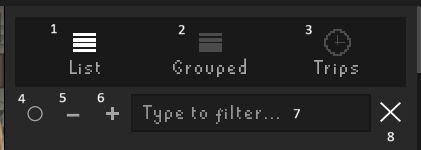

1. List view - displays drops grouped by individual kill
2. Grouped view - displays drops aggregated by NPC name
3. Trip view - displays trips, with drops grouped by trip and NPC name
4. Show or hide excluded NPCs and items
5. Collapse all panels
6. Expand all panels
7. Real-time filter by NPC name (in list and grouped views) or trip name (in trip view)
8. Clear filter

### List View

Each drop is shown individually with the NPC name, combat level, and GE value. Items can be displayed in any view as either sprites or text:

| Sprite view | Text view |
|---|---|
| 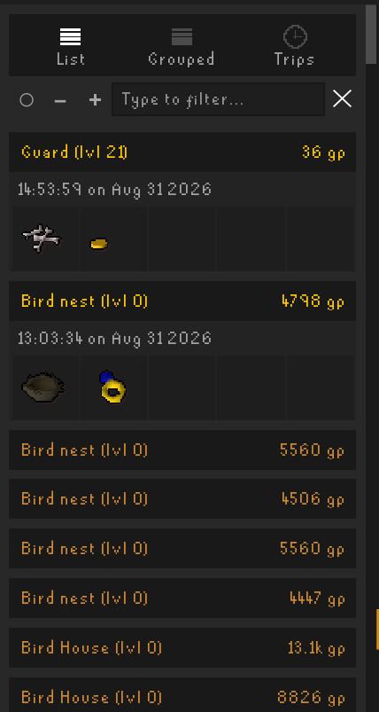 | 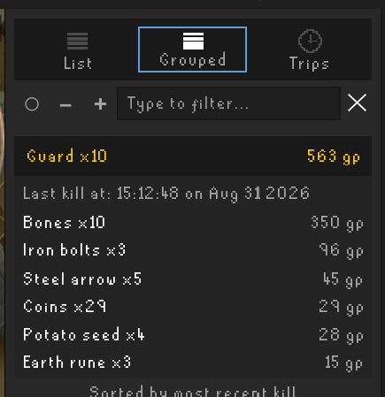 |

### Grouped View

Loot is aggregated by source across all kills, sorted by most recent. Individual entries can be expanded or collapsed by clicking them, or all entries can be toggled at once using the toolbar controls.

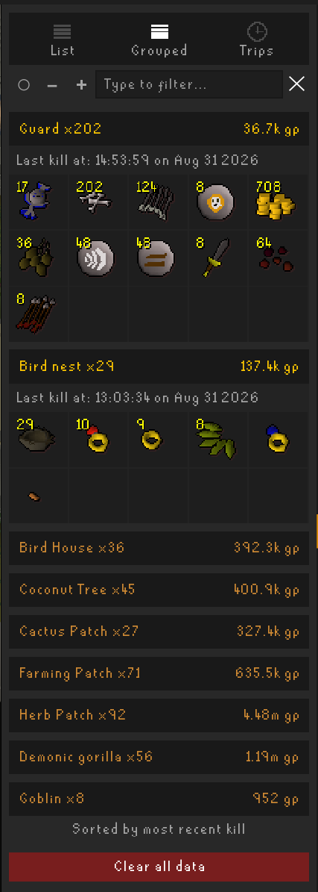

### Trip View

Trips allow loot to be scoped to named sessions. Each trip displays live statistics including kills, total GP, GP/hour, and duration.

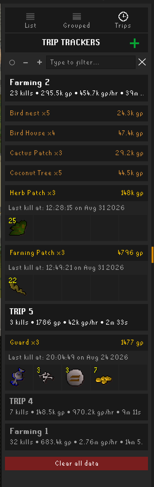

## Trip Management

Trips can be created to track loot for a specific grinding session. All trips persist across client restarts and logouts. A configurable inactivity timeout automatically stops forgotten trips after a set period (default: 3 hours). Paused trips are exempt from this timeout.

| | |
|---|---|
| 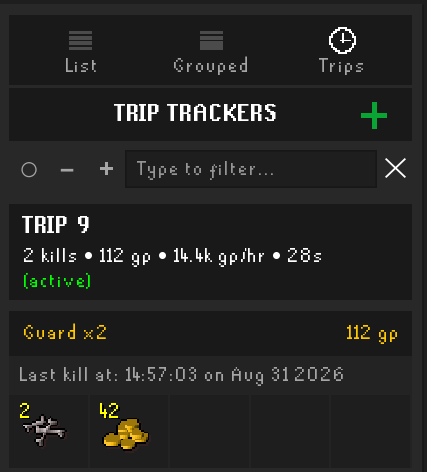 | 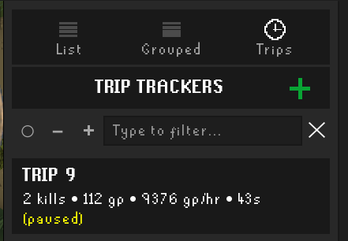 |

- **Active trips** display a green indicator and a live-updating timer.
- **Paused trips** freeze the timer and stop recording drops without ending the trip.

Right-clicking any trip header opens a context menu with management options. Through this menu, trips can be paused, resumed, stopped, compared, deleted, and renamed.

- A trip must be stopped before it can be deleted.
- A trip must be active before it can be paused.
- A trip must be paused before it can be resumed.
- Trips can be renamed, stopped, or compared at any time.

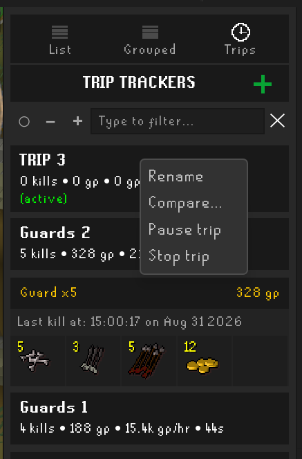

### Trip Comparison

Multiple trips can be selected for side-by-side comparison. Results can be exported to CSV, JSON, or a pretty-printed format, all of which are copied to the clipboard.

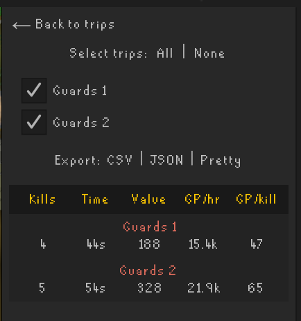

Example export output:

#### CSV

```
Trip Name,Kills,Duration (s),Value,GP/hr,GP/kill,Start,End
Guards 1,4,44,188,15381,47,2026-08-31T14:58:33,2026-08-31T14:59:17
Guards 2,5,54,328,21866,65,2026-08-31T14:59:26,2026-08-31T15:00:21
```

#### JSON

```
[
  {
    "name": "Guards 1",
    "kills": 4,
    "durationSeconds": 44,
    "value": 188,
    "gpPerHour": 15381,
    "gpPerKill": 47,
    "start": "2026-08-31T14:58:33",
    "end": "2026-08-31T14:59:17"
  },
  {
    "name": "Guards 2",
    "kills": 5,
    "durationSeconds": 54,
    "value": 328,
    "gpPerHour": 21866,
    "gpPerKill": 65,
    "start": "2026-08-31T14:59:26",
    "end": "2026-08-31T15:00:21"
  }
]
```

#### Pretty

```
Guards 1
  Kills: 4 | Duration: 44s
  Value: 188 gp | GP/hr: 15.4k | GP/kill: 47

Guards 2
  Kills: 5 | Duration: 54s
  Value: 328 gp | GP/hr: 21.9k | GP/kill: 65
```

## Loot Sources

**Combat** - All NPC kills and PvP kills.

**Thieving** - Pickpocket loot detected via inventory diffing. Coin pouches are displayed with an estimated GP value per NPC.

**Raids and Bosses** - Chambers of Xeric, Theatre of Blood, Tombs of Amascut, Barrows, Fortis Colosseum, and Lunar Chest.

**Minigames and Events** - Clue Scrolls (all tiers), Wintertodt, Tempoross, Guardians of the Rift, Fishing Trawler, Drift Net, and Kingdom of Miscellania.

**Skilling** - Herbiboar, bird houses, Larran's Chest, and farming harvests (herbs, fruit trees, cactus, allotments, and bush patches).

## Configuration

| Setting | Description | Default |
|---|---|---|
| Max drops | Oldest drops are pruned automatically (10–10,000) | 5,000 |
| Max trips | Oldest trips are pruned automatically (5–200) | 50 |
| Trip inactivity timeout | Automatically stops active trips after this duration offline, in minutes. Set to 0 to stop on logout. | 180 |
| Show loot in chat | Posts a GP summary to game chat for each drop | Off |
| Show items as sprites | Toggles between an icon grid and a text list | On |
| Excluded items | Comma-separated list of item names to hide from all views | — |
| Excluded NPCs | Comma-separated list of NPC names to hide from all views | — |

Items and NPCs can also be excluded by right-clicking them directly in the panel:

| | |
|---|---|
| 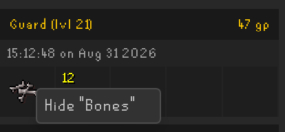 | 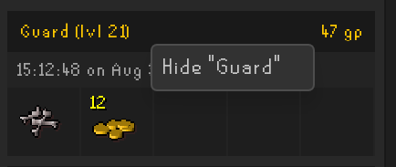 |

## Known Limitations

- Items sent directly to the herb sack or seed box without passing through the inventory may not be tracked.
- Farming harvest detection relies on a debounce timer (approximately 4.2 seconds) after XP ceases. Moving away mid-harvest results in a partial harvest being recorded. Harvested items that drop onto the floor (such as allotments when inventory is full) will result in partial tracking. Other inventory changes occurring before the debounce timer expires (such as picking up items) may cause additional items to be included.
- Coin pouch values are estimates based on average GP per pickpocket for each NPC.
- Chest loot tracked via inventory diff may occasionally miss items if other inventory changes occur on the same game tick.

## Installation

Search for **Trip Tracker** in the RuneLite Plugin Hub.

## Reporting Issues

If a bug or feature request is encountered, please [open an issue](https://github.com/OhansonB/trip-tracker/issues).

If certain items or loot sources do not behave as expected, please include the following information when submitting an issue:

1. **Loot source** - the NPC name, chest name, minigame, or skilling activity involved.
2. **Expected behaviour** - which items should have been tracked.
3. **Actual behaviour** - whether nothing was tracked, items were partially tracked, values were incorrect, or the source name was wrong.
4. **Debug mode output** - whether debug mode was enabled, and if so, the debug chat messages displayed.
5. **Affected views** - whether the issue appeared in the list, grouped, or trip view, or across all views.

The most effective way to enable troubleshooting is to reproduce the issue with debug mode enabled and provide a screenshot of the game chat at the relevant moment. Please ensure any sensitive information is redacted before sharing.
